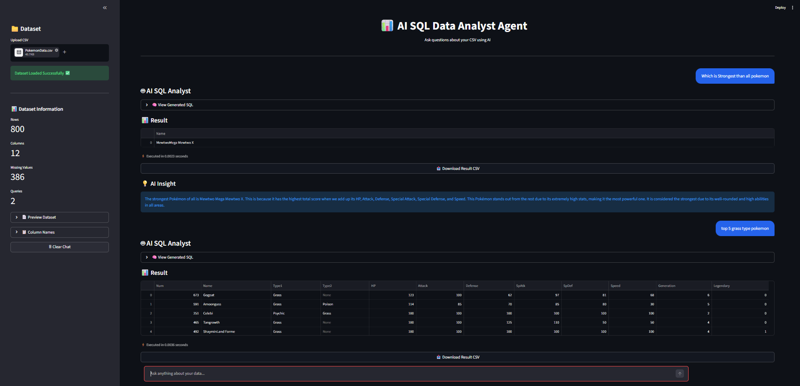

# 📊 AI SQL Data Analyst Agent

> An AI-powered SQL Data Analyst that allows users to analyze CSV datasets using natural language. Upload a CSV file, ask questions in plain English, and let AI generate SQL queries, execute them, visualize the results, and provide AI-powered insights.

---

# 📸 Application UI

## 📸 Application UI



---

## 🚀 Features

- 📁 Upload any CSV dataset
- 🤖 Ask questions in natural language
- 🧠 AI generates SQLite queries automatically
- ⚡ Executes SQL queries on uploaded data
- 📊 Displays query results in interactive tables
- 📈 Automatically generates visualizations
- 💡 AI-generated insights
- 📥 Download query results as CSV
- 📋 View generated SQL queries
- 🗑️ Clear chat history
- 📌 Dataset preview and statistics
- 💬 ChatGPT-inspired conversational interface

---

## 🛠️ Tech Stack

- Python
- Streamlit
- SQLite
- Groq API (Llama 3.3 70B)
- LangChain
- Pandas
- Matplotlib
- python-dotenv

---

## 📂 Project Structure

```text
AI-SQL_DATA-ANALYST/
│
├── app.py
├── data.db
├── .env
├── requirements.txt
├── README.md
│
└── assets/
    └── UI.png
```

---

## ⚙️ Installation

### Clone Repository

```bash
git clone https://github.com/your-username/AI-SQL_DATA-ANALYST.git

cd AI-SQL_DATA-ANALYST
```

### Create Virtual Environment

**Windows**

```bash
python -m venv myenv
myenv\Scripts\activate
```

**Linux/macOS**

```bash
python3 -m venv myenv
source myenv/bin/activate
```

### Install Dependencies

```bash
pip install -r requirements.txt
```

or

```bash
pip install streamlit pandas matplotlib langchain langchain-community langchain-groq python-dotenv
```

### Create `.env`

```env
GROQ_API_KEY=your_groq_api_key
```

### Run

```bash
streamlit run app.py
```

---

## 💬 Example Questions

- Show the top 10 strongest Pokémon
- Which Pokémon has the highest HP?
- Average Attack by Type
- Count Legendary Pokémon
- Top 5 fastest Pokémon
- Show Pokémon with HP greater than 100
- Show all Fire-type Pokémon
- Count Pokémon by Generation

---

## 🔄 Workflow

```text
Upload CSV
      │
      ▼
Store Data in SQLite
      │
      ▼
Ask Question
      │
      ▼
Groq LLM Generates SQL
      │
      ▼
Execute SQL Query
      │
      ▼
Display Query Result
      │
      ▼
Generate Visualization
      │
      ▼
Generate AI Insight
```

---

## 🌟 Current Features

- ✅ Upload CSV Dataset
- ✅ Natural Language to SQL
- ✅ AI SQL Generation
- ✅ SQLite Query Execution
- ✅ Interactive Chat Interface
- ✅ Dataset Preview
- ✅ Dataset Statistics
- ✅ Automatic Visualization
- ✅ AI Insights
- ✅ Download Results as CSV
- ✅ Clear Chat

---

## 🚀 Future Enhancements

- Smart chart selection (Bar, Pie, Scatter, Line)
- Interactive Plotly visualizations
- Export analysis as PDF
- Multiple dataset support
- Dashboard analytics
- Query history
- Database connectivity (MySQL/PostgreSQL)
- Cloud deployment

---

## 👨‍💻 Author

**RB**

**B.E. Artificial Intelligence & Data Science**

### Skills

- Python
- SQL
- Artificial Intelligence
- Machine Learning
- Streamlit
- LangChain
- Groq API
- Data Analytics

---

## ⭐ Support

If you found this project helpful, please consider giving it a **⭐ Star** on GitHub.
